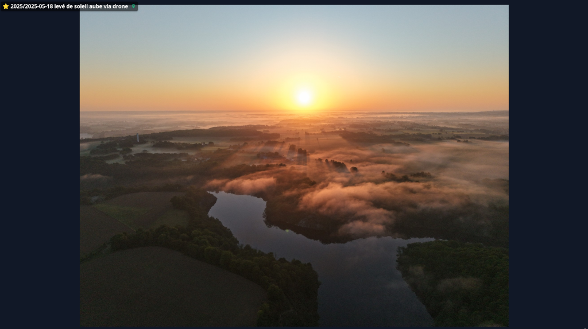
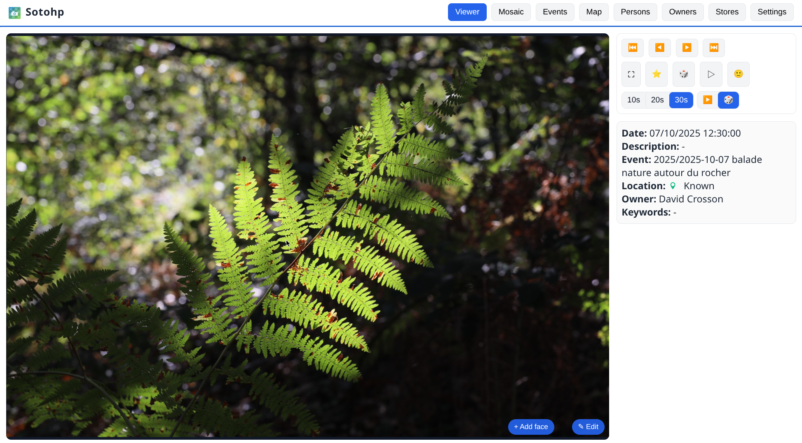
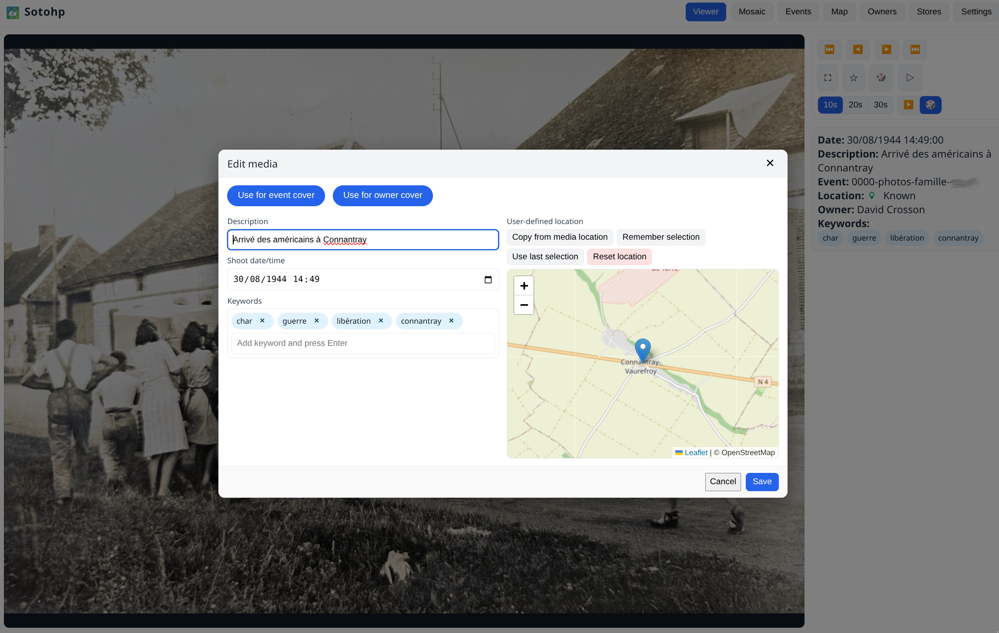
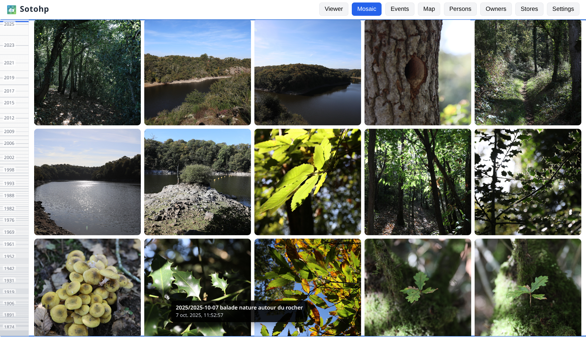
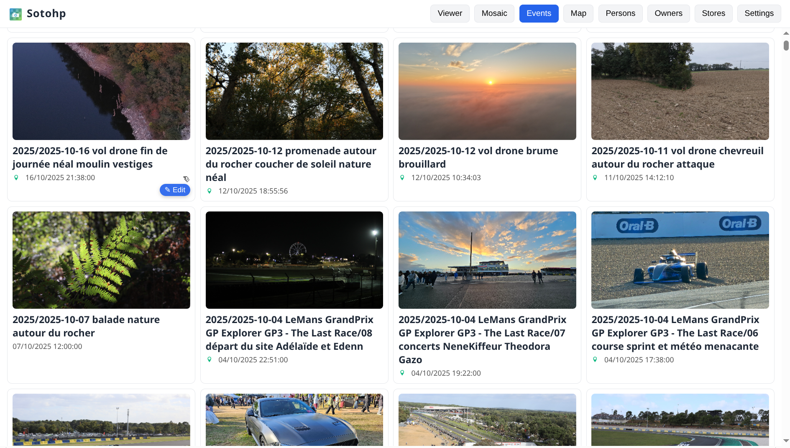
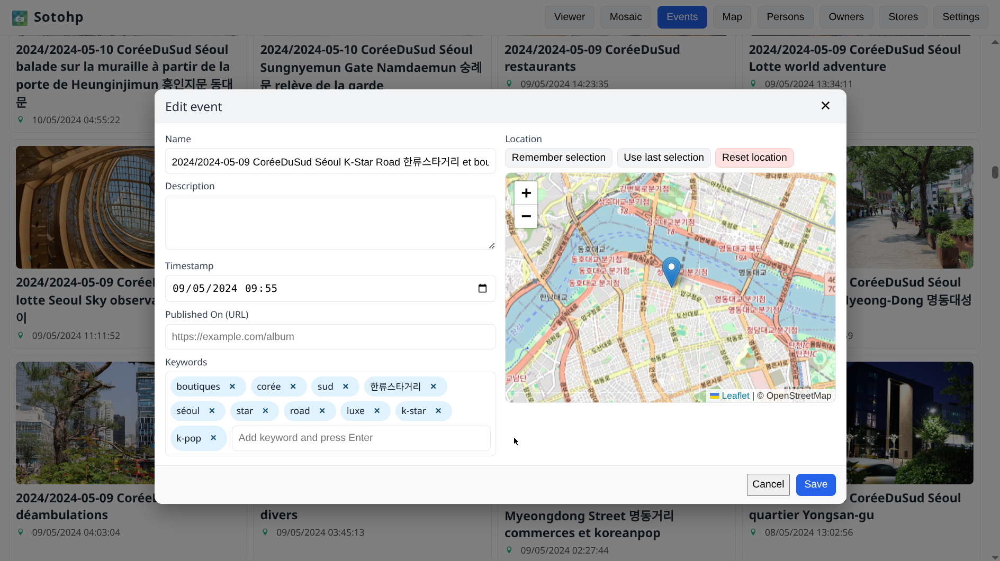
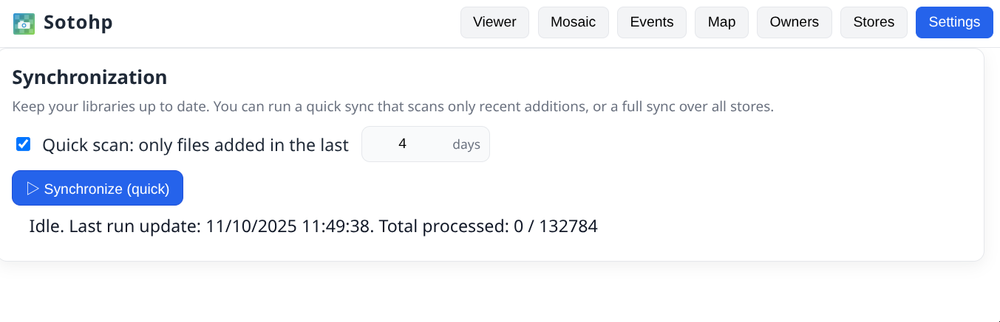
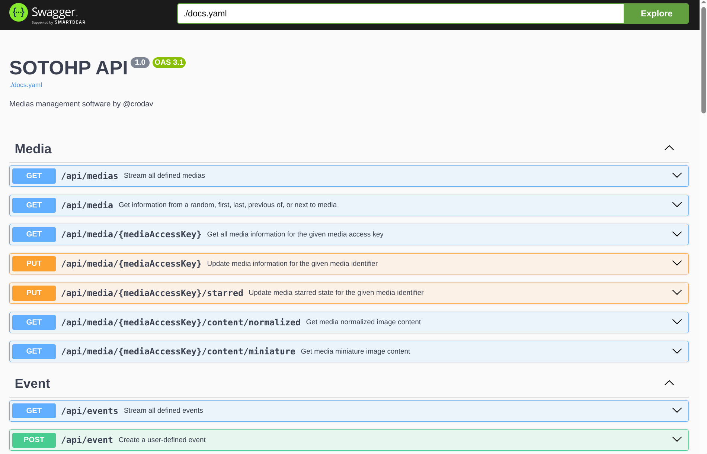
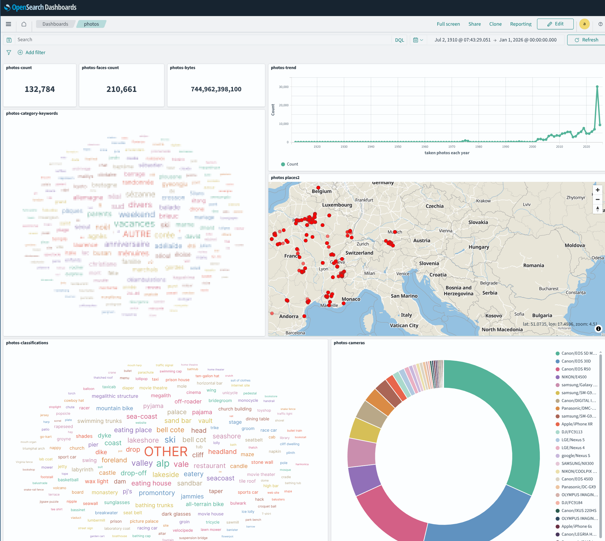
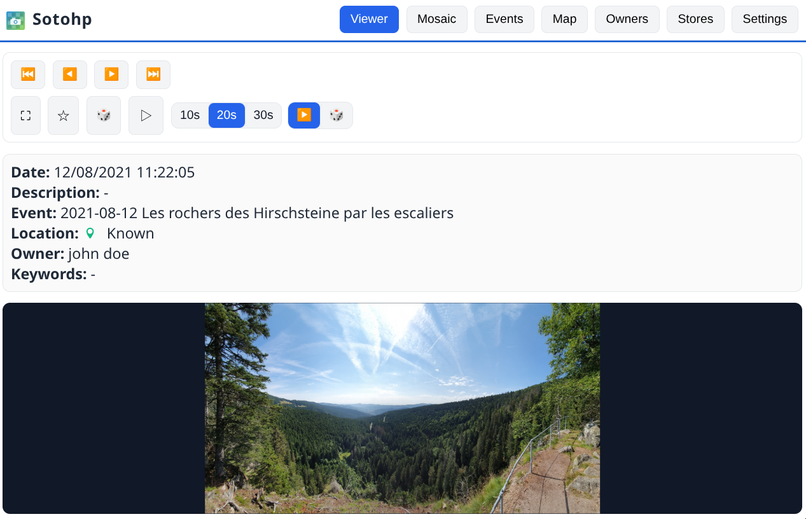

# SOTOHP [![][sotohpImg]][sotohpLnk]

A software to easily and quickly manage and annotate a huge number of photos.

Why? Just because those past 123 years 😉 we have to deal with almost **140,000 photos** through 2,000 family events.

My two favorite features are the diaporama and the ability to enrich photo descriptions,
adjust locations with family members or friends from anywhere.



Once again this project has first started as just [a "small" script][photosc], first published on Dec 19, 2021!

## Principles

- The photo referential is always your photos directories as you organize them,
    - Continue to use your favorite file manager for that task,
    - Keep your directory tree unchanged
    - Add new directories and new files
    - Use, for convenience, such a pattern for your storage `2025/2025-10-11 event label/photo.jpg`
- Your photos directories are left unchanged, only read operations are done,
- Cache is used for pre-computed photos, miniatures, people's faces, detected objects, ...
- A database is used to manage all your added metadata such as description, keywords, fixed location, fixed dates,
  stars, ... and also to keep track of all people detected faces, detected objects, image classifications, ...

## Current status

- Released first as a docker application, [see below for more details](#docker-container-quick-start),
- comes with a [REST API](frontend-user-interface/openapi/docs.yaml) and a **web user interface** providing:
    - fast visualization,
    - photos diaporama,
    - timeline mosaic browsing,
    - customizing locations, dates, keywords, descriptions, ...
    - managing events,
    - managing owners and storage directories,
    - synchronize originals from multiple storage directories,
    - ...
- ⚠️ keep in mind that this software is currently designed for use in **private home network**,
  do not expose it directly to the internet without configuring a secured reverse proxy, know
  what you do!

## User interfaces

The web user interface is quite fast, user-friendly and feature-rich, with behind the scene a REST API:


















## Configuration

User configuration is done through environment variables, the main ones are:

| variable                                   | description                                                     | default value           |
|--------------------------------------------|-----------------------------------------------------------------|-------------------------|
| `PHOTOS_CACHE_DIRECTORY`                   | Cache for optimized, miniatures, faces, ... images              | `.sotohp` (current dir) |
|                                            |                                                                 |                         |
| `PHOTOS_DATABASE_PATH`                     | Database storage directory ([LMDB][lmdb])                       | `.lmdb` (current dir)   |
|                                            |                                                                 |                         |
| `PHOTOS_FILE_SYSTEM_SEARCH_LOCK_DIRECTORY` | Media originals store prison location base                      | `/data/ALBUMS`          |
| `PHOTOS_FILE_SYSTEM_SEARCH_MAX_DEPTH`      | Media originals max search depth                                | `10`                    |
| `PHOTOS_FILE_SYSTEM_SEARCH_FOLLOW_LINKS`   | Media originals Search can follow symbolic links                | `false`                 |
|                                            |                                                                 |                         |
| `PHOTOS_ELASTIC_ENABLED`                   | Enable optional Elasticsearch/Opensearch search engine          | `true`                  |
| `PHOTOS_ELASTIC_URL`                       | Elasticsearch/Opensearch : Connection URL                       | `http://127.0.0.1:9200` |
| `PHOTOS_ELASTIC_URL_TRUST_SELF_SIGNED`     | Elasticsearch/Opensearch : Allowing self signed SSL certificate | `false`                 |
| `PHOTOS_ELASTIC_USERNAME`                  | Elasticsearch/Opensearch : username                             |                         |
| `PHOTOS_ELASTIC_PASSWORD`                  | Elasticsearch/Opensearch : password                             |                         |
|                                            |                                                                 |                         |
| `PHOTOS_LISTENING_PORT`                    | Web server and API listening port                               | `8080`                  |

## Docker demo container quick start

```
docker run --rm -it -p 8888:8080 --name sotohp_demo sotohp_demo:latest
```
And then visit http://localhost:8888/ for a preinitialized sotohp instance :  


## Docker container start
[dacr/sotohp docker images information](https://hub.docker.com/r/dacr/sotohp)
```
docker run \
  -p 8888:8080 \
  -v "/my/path/to/my/albums:/data/ALBUMS" \
  -v "/where/to/keep/sotohp/data:/data/SOTOHP" \
  --name sotohp \
  dacr/sotohp:latest
```

[photosc]: https://gist.github.com/dacr/46718666ae96ebac300b27c80ed7bec3

[lmdb]: https://github.com/dacr/zio-lmdb

[sotohp]:    https://github.com/dacr/sotohp

[sotohpImg]: https://img.shields.io/maven-central/v/fr.janalyse/sotohp-model_3.svg

[sotohpLnk]: https://mvnrepository.com/artifact/fr.janalyse/sotohp-model
