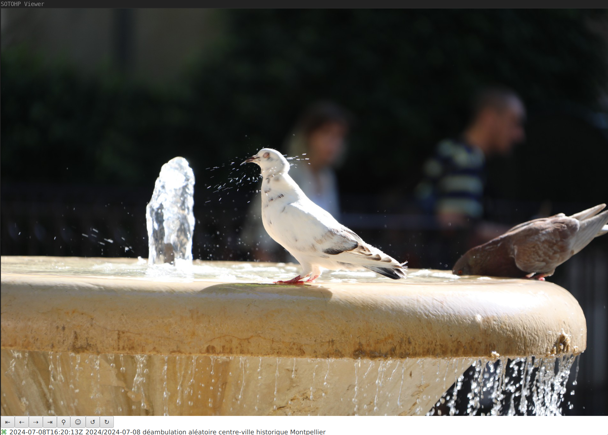
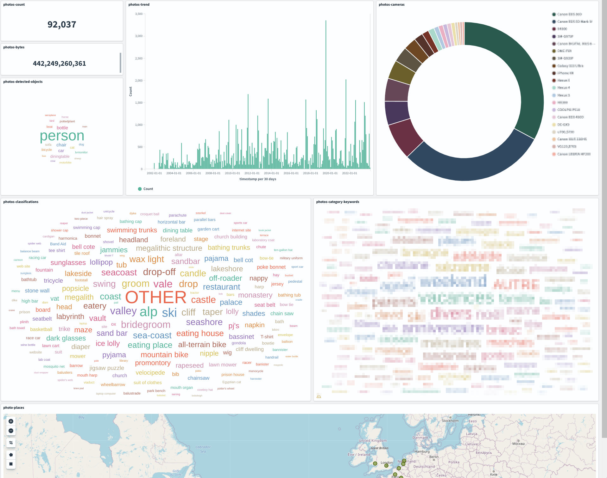

# SOTOHP [![][sotohpImg]][sotohpLnk]

A software to easily and quickly manage a huge amount of photos. Why ? Just because those past 123 years 😉 we've had to deal with almost **140000 photos** through 2000 family events.

Once again this project has first started as just [a "small" script][photosc].

## Principles

- The photo referential is always your photos directories as you've organized them,
- Your photos directories are left unchanged, only read operations are done,
- Cache is used for pre-computed photos, miniatures, people faces, detected objects, ...
- A simple database is used to store all your added metadata such as description, keywords, fixed location, fixed dates, stars, ... 

## Current status
- no release available yet
- code is stable and usable for
  - visualization
  - publishing photo records to elasticsearch / opensearch
  - searching and statistics purposes

The visualisation with the graphical user interface is very fast :) It starts in 2 seconds even with my 103000 photo database.  

Published information to elasticsearch or opensearch make it easy to build very interesting dashboards such as :

[photosc]: https://gist.github.com/dacr/46718666ae96ebac300b27c80ed7bec3
[ulid]: https://github.com/ulid/spec
[djl]: https://github.com/deepjavalibrary/djl
[lmdb]: https://github.com/dacr/zio-lmdb

[sotohp]:    https://github.com/dacr/sotohp
[sotohpImg]: https://img.shields.io/maven-central/v/fr.janalyse/sotohp-model_3.svg
[sotohpLnk]: https://mvnrepository.com/artifact/fr.janalyse/sotohp-model
