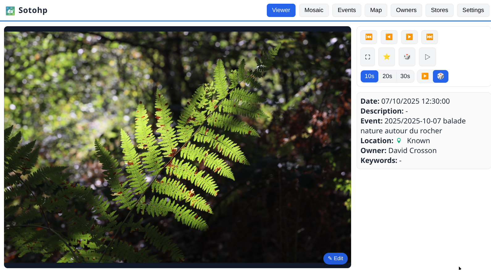
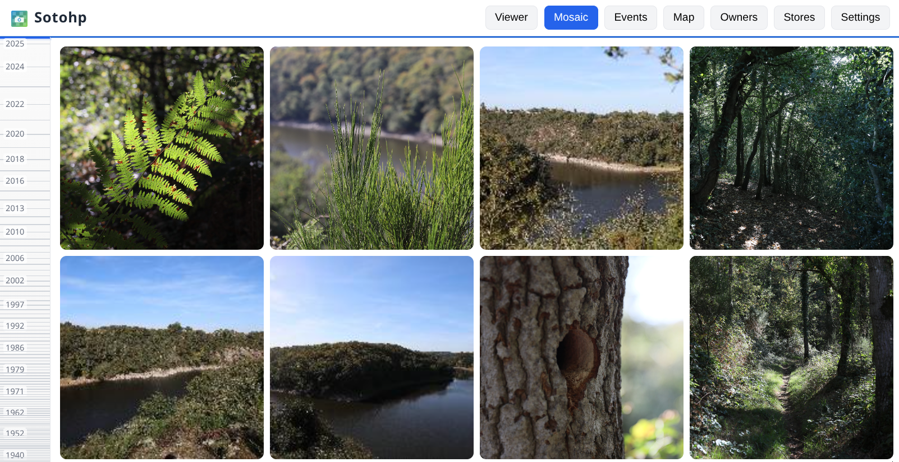
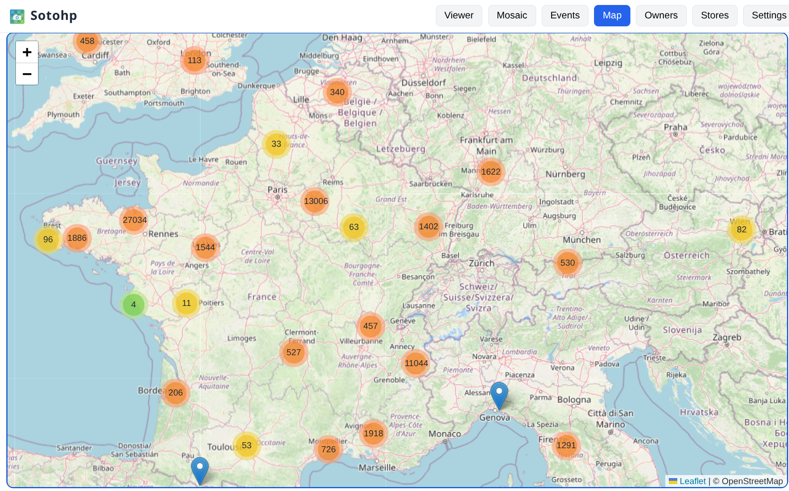

# SOTOHP [![][sotohpImg]][sotohpLnk]

A software to easily and quickly manage a huge amount of photos. Why ? Just because those past 123 years 😉 we have to
deal with almost **140,000 photos** through 2,000 family events.

Once again this project has first started as just [a "small" script][photosc], first published on Dec 19, 2021!

## Principles

- The photo referential is always your photos directories as you've organized them,
- Your photos directories are left unchanged, only read operations are done,
- Cache is used for pre-computed photos, miniatures, people faces, detected objects, ...
- A simple database is used to store all your added metadata such as description, keywords, fixed location, fixed dates,
  stars, ... and also to keep track of all people detected faces, detected objects, image classifications, ...

## Current status

- will be released soon as a standalone docker application,
- comes with an API and a **web user interface** providing:
    - fast visualization,
    - automatic slideshow,
    - timeline mosaic browsing,
    - managing locations, dates, keywords, descriptions, ...
    - managing events,
    - managing several owners and storage directories.

## User interfaces

The web user interface is quite fast, user-friendly and feature-rich, and behind the scene a REST API is available:

## Configuration

User configuration is done through environment variables, the main ones are:

| variable                                   | description                                                     | default value           |
|--------------------------------------------|-----------------------------------------------------------------|-------------------------|
| `PHOTOS_CACHE_DIRECTORY`                   | Cache for optimized, miniatures, faces, ... images              | `.sotohp` (current dir) |
|                                            |                                                                 |                         |
| `PHOTOS_LMDB_PATH`                         | Database storage directory ([LMDB][lmdb])                       | `.lmdb` (current dir)   |
|                                            |                                                                 |                         |
| `PHOTOS_FILE_SYSTEM_SEARCH_LOCK_DIRECTORY` | Media originals store prison location base                      | `/data/ALBUMS`          |
| `PHOTOS_FILE_SYSTEM_SEARCH_MAX_DEPTH`      | Media originals max search depth                                | `10`                    |
| `PHOTOS_FILE_SYSTEM_SEARCH_FOLLOW_LINKS`   | Media originals Search can follow symbolic links                | `false`                 |
|                                            |                                                                 |                         |
| `PHOTOS_ELASTIC_ENABLED`                   | Enable optional Elasticsearch/Opensearch search engine          | `true`                  |
| `PHOTOS_ELASTIC_URL`                       | Elasticsearch/Opensearch : Connection URL                       | `http://127.0.0.1:9200` |
| `PHOTOS_ELASTIC_URL_TRUST_SELF_SIGNED`     | Elasticsearch/Opensearch : Allowing self signed SSL certificate | `false`                 |
| `PHOTOS_ELASTIC_USERNAME`                  | Elasticsearch/Opensearch : username                             |                         |
| `PHOTOS_ELASTIC_PASSWORD`                  | Elasticsearch/Opensearch : password                             |                         |

[photosc]: https://gist.github.com/dacr/46718666ae96ebac300b27c80ed7bec3

[lmdb]: https://github.com/dacr/zio-lmdb

[sotohp]:    https://github.com/dacr/sotohp

[sotohpImg]: https://img.shields.io/maven-central/v/fr.janalyse/sotohp-model_3.svg

[sotohpLnk]: https://mvnrepository.com/artifact/fr.janalyse/sotohp-model
