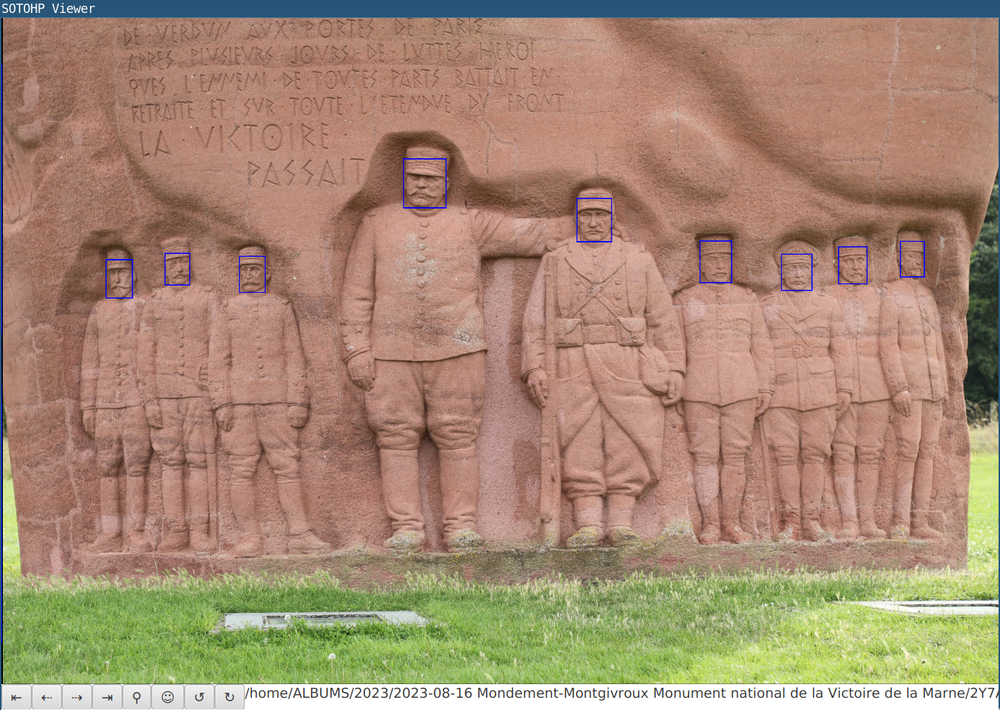

# SOTOHP [![][sotohpImg]][sotohpLnk]

A software to easily and quicly manage a huge amount of photos. Why ? Just because those past 23 years, I've taken more than 90000
photos. Once again this project has first started as just [a "small" script][photosc].

## Principles

- The photos referential is always your photos directories as you've organized them,
- Your photos directories are left unchanged, only read operations are done,
- A local [LMDB database][lmdb] is used to store/cache/query, serialization is JSON based,
- Background jobs are run to update, to enrich, to analyze, to process your photos
- Dedicated Filesystem targets for pre-processed photos
- Photos are identified using an [ULID][ulid] identifier computed from the shoot timestamp
  - if shoot timestamp is missing or invalid, file last modified is used (at first seen)
  - SO photos stream is automatically ordered by this timestamp
- [DeepJavaLibrary][djl] is intensively used for 
  - photos classifications,
  - people faces detection,
  - objects detection,...

## Current status
- no release available yet
- code is stable and usable for
  - searching and statistics purposes
  - visualization

The visualisation with the graphical user interface is very fast :)  

[photosc]: https://gist.github.com/dacr/46718666ae96ebac300b27c80ed7bec3
[ulid]: https://github.com/ulid/spec
[djl]: https://github.com/deepjavalibrary/djl
[lmdb]: https://github.com/dacr/zio-lmdb

[sotohp]:    https://github.com/dacr/sotohp
[sotohpImg]: https://img.shields.io/maven-central/v/fr.janalyse/sotohp-model_3.svg
[sotohpLnk]: https://mvnrepository.com/artifact/fr.janalyse/sotohp-model
