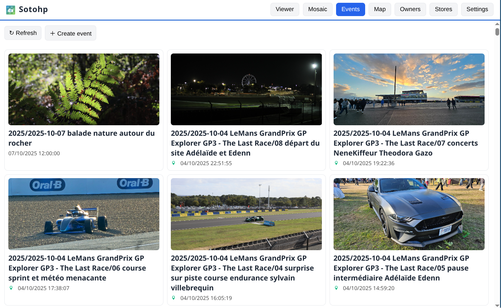

# SOTOHP [![][sotohpImg]][sotohpLnk]

A software to easily and quickly manage and annotate a huge number of photos.

Why? Just because those past 123 years 😉 we have to deal with almost **140,000 photos** through 2,000 family events.

My favorite features are, of course, the diaporama, but also **people face identification**, **location fix**, ...
All of this achieved interactively with family members or friends from anywhere.


Once again this project has first started as just [a "small" script][photosc], first published on Dec 19, 2021!

## Principles

- The photo referential is always your photos directories as you organize them,
    - Continue to use your favorite file manager for that task,
    - Keep your directory tree unchanged
    - Add new directories and new files
    - Use, for convenience, such a pattern for your storage `2025/2025-10-11 event label/photo.jpg`
- Your photos directories are left unchanged, only read operations are done,
- Cache is used for pre-computed photos, miniatures, people's faces, detected objects, ...
- A database is used to manage all your added metadata such as description, keywords, fixed location, fixed dates,
  stars, ... and also to keep track of all people detected faces, detected objects, image classifications, ...

## Current status

- Released first as a docker application, [see below for more details](#docker-container-quick-start),
- comes with a [REST API](docs/sotohp-api-docs.json) and a **web user interface** providing:
    - fast visualization,
    - photos diaporama,
    - timeline mosaic browsing,
    - customizing locations, dates, keywords, descriptions, ...
    - people faces management and identification, 
    - managing events,
    - managing owners and storage directories,
    - synchronize originals from multiple storage directories,
    - ...
- ⚠️ keep in mind that this software is currently designed for use in **private home network**,
  do not expose it directly to the internet without configuring a secured reverse proxy, know
  what you do!
  - **Note:** Basic Role-Based Access Control (RBAC) via Keycloak is now supported but disabled by default. See `docs/SECURITY_PLAN.md`.
- ⚠️ automated face recognition is still a batch process, done by this command [FaceInference](user-interfaces/cli/src/main/scala/fr/janalyse/sotohp/cli/FaceInference.scala)
  - the current implementation is basic: shortest Euclidean distance on face features 

## User interfaces

The web user interface is quite fast, user-friendly and feature-rich, with behind the scene a REST API.

### The viewer


### The viewer with faces and names enabled


### The viewer editing capabilities


### The timeline mosaic


### The events management


### The events editing capabilities


### Viewing photos on a zoomable world map


### The people management


### The people faces management


### The people faces validation


### The people faces editing capabilities


### The settings


### The REST API


### The dashboard when opensearhc is enabled


## Configuration

User configuration is done through environment variables, the main ones are:

| variable                                   | description                                                     | default value           |
|--------------------------------------------|-----------------------------------------------------------------|-------------------------|
| `PHOTOS_CACHE_DIRECTORY`                   | Cache for optimized, miniatures, faces, ... images              | `.sotohp` (current dir) |
|                                            |                                                                 |                         |
| `PHOTOS_DATABASE_PATH`                     | Database storage directory ([LMDB][lmdb])                       | `.lmdb` (current dir)   |
|                                            |                                                                 |                         |
| `PHOTOS_FILE_SYSTEM_SEARCH_LOCK_DIRECTORY` | Media originals store prison location base                      | `/data/ALBUMS`          |
| `PHOTOS_FILE_SYSTEM_SEARCH_MAX_DEPTH`      | Media originals max search depth                                | `10`                    |
| `PHOTOS_FILE_SYSTEM_SEARCH_FOLLOW_LINKS`   | Media originals Search can follow symbolic links                | `false`                 |
|                                            |                                                                 |                         |
| `PHOTOS_ELASTIC_ENABLED`                   | Enable optional Elasticsearch/Opensearch search engine          | `true`                  |
| `PHOTOS_ELASTIC_URL`                       | Elasticsearch/Opensearch : Connection URL                       | `http://127.0.0.1:9200` |
| `PHOTOS_ELASTIC_URL_TRUST_SELF_SIGNED`     | Elasticsearch/Opensearch : Allowing self signed SSL certificate | `false`                 |
| `PHOTOS_ELASTIC_USERNAME`                  | Elasticsearch/Opensearch : username                             |                         |
| `PHOTOS_ELASTIC_PASSWORD`                  | Elasticsearch/Opensearch : password                             |                         |
|                                            |                                                                 |                         |
| `PHOTOS_LISTENING_PORT`                    | Web server and API listening port                               | `8080`                  |

## MCP Server Integration

The SOTOHP MCP server allows LLMs (like via `gemini-cli`) to interact with your photo collection.

### 1. Build the MCP Server
```bash
mill user-interfaces.mcp.assembly
```
The JAR will be created at `out/user-interfaces/mcp/assembly.dest/out.jar`.

### 2. Obtain an API Token
If authentication is enabled, you need a JWT token for the `SOTOHP_API_TOKEN` environment variable.

#### From the Web UI (Manual)
1. Log in to the SOTOHP Web UI.
2. Open Browser Developer Tools (`F12`).
3. Go to the **Application** or **Storage** tab.
4. Under **Local Storage**, look for a key starting with `kc-token` or similar (from Keycloak).
5. Alternatively, go to the **Network** tab, refresh the page, find any `/api/` request, and copy the `Authorization: Bearer <TOKEN>` value.

#### Using curl (Automated)
If your Keycloak realm allows direct password grant:
```bash
TOKEN=$(curl -s -X POST "http://localhost:8081/realms/sotohp/protocol/openid-connect/token" \
     -H "Content-Type: application/x-www-form-urlencoded" \
     -d "client_id=sotohp-web" \
     -d "username=admin" \
     -d "password=admin" \
     -d "grant_type=password" | jq -r '.access_token')
export SOTOHP_API_TOKEN=$TOKEN
```

### 3. Configure Gemini CLI
Add this to your `settings.json`:
```json
{
  "mcpServers": {
    "sotohp": {
      "command": "java",
      "args": ["-jar", "/path/to/sotohp/out/user-interfaces/mcp/assembly.dest/out.jar"],
      "env": {
        "SOTOHP_API_URL": "http://localhost:8080",
        "SOTOHP_API_TOKEN": "your-extracted-token"
      }
    }
  }
}
```

## Docker demo container quick start

```
docker run --rm -it -p 8888:8080 dacr/sotohp_demo:latest
```
And then visit http://localhost:8888/ for a preinitialized sotohp instance :  


## Docker container start
[dacr/sotohp docker images information](https://hub.docker.com/r/dacr/sotohp)
```
docker run \
  -p 8888:8080 \
  -v "/my/path/to/my/albums:/data/ALBUMS" \
  -v "/where/to/keep/sotohp/data:/data/SOTOHP" \
  --name sotohp \
  dacr/sotohp:latest
```

[photosc]: https://gist.github.com/dacr/46718666ae96ebac300b27c80ed7bec3

[lmdb]: https://github.com/dacr/zio-lmdb

[sotohp]:    https://github.com/dacr/sotohp

[sotohpImg]: https://img.shields.io/maven-central/v/fr.janalyse/sotohp-model_3.svg

[sotohpLnk]: https://mvnrepository.com/artifact/fr.janalyse/sotohp-model
